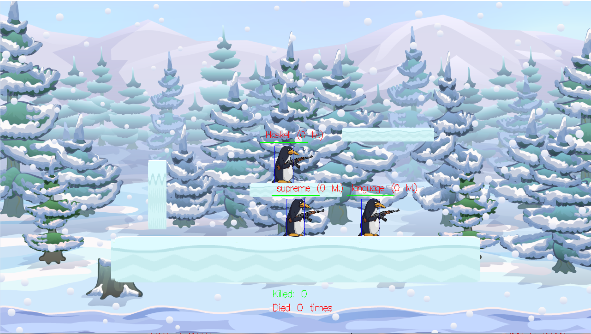

# Lambda Shooter 

This simple game is a semester project for Haskell elective course. It is written in pure Haskell using Gloss for graphics, JuicyPixels for loading custom textures, and some other packages (list will be provided later). 

## How it looks like now

## Game description 

This is an online game with client and server parts. You control a penguin in an all-against-all combat. Earn levels to increase the damage of your weapon. Die, and you loose a level. Fall or catch a fatal bullet, and you die. The rules are very simple. Can you survive and reach the highest level?

## How to use

Since it is multiplayer game, you will need a server. If you want, you can simply run it on your computer, or somewhere else. 
To use the server (and the client) you will need [Stack](https://docs.haskellstack.org/en/stable/README/) installed. 
To launch a server, first you need to  update the `defaultIP` in the `src/Constants.hs` file and set it to the IP address of your machine. Then you can go into the project root directory and use command `stack run server`. 
After the server is ready, you can launch a client. For that, use `stack run client <username>` from the project root directory (username is optional, if you do not provide it you will be assigned a default name). Enjoy the game!

## How it all works
In this section we describe demo.
Note: In master we use Universe instead of world which containts both graphics and world itself. By extracting all graphics(Picture,Animations) from `World`, we achieved easy serialization of `World` and all of its components. In addition we use `TChan`s instead of `TVar`s.
`
### Server

Well, the most recent version uses these important types:
- `type Client     = (ID, WS.Connection)`
- `type ServerState = (World, [Client])`

On a server we keep only one world version which is to be trated as the most "recent" & "trustful".
For each client we create a separate thread which waits for client World and merges it with our one.
Then all the changes are broadcasted to all Clients so that they get the most recent changes and game looks as smooth as possible.
Server is also resposible for calculation the collision between player and projectiles, do damage, kill and respawn players and change their statistics.

### Client

Uses `playIO` from `Gloss` as the main loop. This in turn has 3 major components to it: 
- `renderWorldIO :: World -> IO Picture`
- `handleInputIO :: Event -> World -> IO World`
- `updateWorldIO :: TVar \[ClientInfo\] -> TVar ClientInfo -> PlayerAnimationTable -> Float -> World  -> IO World`

The last one looks fairly complicated, but will get to that. First, let me start with the first item: `renderWorldIO`.
It is basically a pure `renderWorld` function wrapped in `IO` context. All it does is render four components: world map, all entities, UI, and collision boxes (for debug purposes). Most of the functions are fairly simple and routine. Unfortunately, there were necessities to hand pick the correct position tweaks or scales for many things. For example, positioning of UI elements or player texture offset. 

On the other hand, we were able to automate a very tedious and boring task in a fun and fast way. We had a problem with animations: some of them had different dimensions than others, and would cause some unpleasant visual glitches. To solve this, we needed to cut all pictures in all animations. But instead of doing it manually, we wrote a Python script using Pillow to cut out transparent rows. After that, the glitches were gone.

The next function, `handleInputIO`, is the simplest of the three. Because Gloss sends input events *only* if there was some input (e.g. if user presses a button, it will only tell that the press occured, and will not send events while the key is down), we added `KeyboardData` to store the state of tracked buttons (space, a, d, and left mouse button). So the only job of `handleInput` is to update this data accordingly to the events (and `handleInputIO` is just a wrapped `handleInput`). 

Finally, `updateWorldIO` function receive server updates from thread using `TVar[ClientInfo]`, merge world with the new received one and apply pure `updateWorld`. Finally, it saves the updated world to another `Tvar ClientInfo` and return our new world.

## Results: What is Working

We implemented most of what we planned. Some notable features include:
- collision detection (players and map, players and bullets)
- custom textures and animations
- multiplayer (client and server standalone programs)
- levels depending on the statistics which increase the bullets power
- etc.

## Results: What is not Working

We didn't manage to finish:
- killing other players, falling to death and respawning
- statistics of deaths and kills

All of this implemented in master, which currently have big issues with perfomance due to last switches to `TChans`.

## What can be improved

It would be nice to fix perfomance issues on master. I believe big issues came from saving each frame to a `TChan` which is unbounded queue because `TVars` was nice in term of perfomance. First, it is good idea to communicate using more lightweight structure rather than` World`. Second, maybe instead of sending each frame we should accumulate world changes and send them pereodically (every 30 ms for example), not each frame. Also, would be nice to track current animation frame of each player Entity. So that we can play reasonable animation of all clients.

